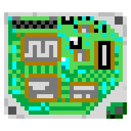

    

# snes-apu-spcp

snes-apu-spcp is an emulator for the SNES/SFC sound hardware, designed for use
in SPCPresenter. It is a continuation of the [emu-rs/snes-apu][snes-apu] crate.

## Functionality

- Cycle-accurate SMP and DSP emulation.

[snes-apu]: https://github.com/emu-rs/snes-apu